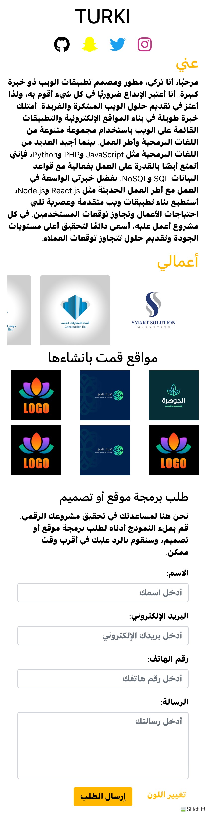

# DVTe

# Colorful Portfolio Website

## Script Description

This script is an HTML page that demonstrates a simple example of a portfolio website. It showcases the developer's information, their works, and includes a simple contact form for users who wish to request website development or design services.

The script is designed to provide a visually appealing and responsive layout using HTML, CSS, and the Bootstrap framework. It incorporates modern web design practices and features Font Awesome icons to enhance the user experience and provide quick access to social media profiles.

The contact form included in the script allows users to enter their name, email address, phone number, and message. Upon clicking the submit button, the form data can be processed and sent to the developer for further communication.

## Components and Features

The script utilizes several components and features, including:

- HTML and CSS: HTML is used to structure the elements on the page, while CSS is used to style the text and define the visual appearance.
- Bootstrap: The Bootstrap framework is employed to create a responsive and aesthetically pleasing design for the website. It ensures that the website adapts well to different screen sizes and devices.
- Font Awesome Icons: The Font Awesome icon library is integrated to provide a wide range of visually appealing icons, including popular social media icons.
- Simple Contact Form: The script includes a straightforward contact form that captures the user's name, email address, phone number, and message. This allows users to easily reach out to the developer for inquiries or project requests.

## Website Preview

Here is an image preview of the website in the three different colors:

### Colors

# موقع تعريفي ملوّن

## وصف السكربت

هذا السكربت هو صفحة HTML توضح مثالًا بسيطًا لموقع تعريفي. يعرض المطور معلوماته وأعماله ويتضمن نموذج اتصال بسيط للمستخدمين الذين يرغبون في طلب خدمات تطوير المواقع أو التصميم.

السكربت مصمم لتوفير تصميم جذاب ومتجاوب باستخدام لغات HTML و CSS وإطار العمل Bootstrap. يتضمن السكربت ممارسات تصميم الويب الحديثة ويستخدم رموز الأيقونات Font Awesome لتعزيز تجربة المستخدم وتوفير وصول سريع إلى ملفات التواصل الاجتماعي.

يحتوي السكربت على نموذج اتصال يسمح للمستخدمين بإدخال اسمهم وعنوان البريد الإلكتروني ورقم الهاتف والرسالة. عند النقر فوق زر الإرسال، يتم معالجة بيانات النموذج وإرسالها إلى المطور للتواصل اللاحق.

## المكونات والميزات

يستخدم السكربت عدة مكونات وميزات، بما في ذلك:

- HTML و CSS: يستخدم HTML لترتيب العناصر في الصفحة، بينما يستخدم CSS لتنسيق النصوص وتعريف المظهر البصري.
- Bootstrap: يستخدم إطار العمل Bootstrap لإنشاء تصميم استجابة وجميل للموقع. يضمن أن الموقع يتكيف بشكل جيد مع مختلف أحجام الشاشة والأجهزة.
- رموز الأيقونات Font Awesome: يتم دمج مكتبة رموز الأيقونات Font Awesome لتوفير مجموعة واسعة من الأيقونات الجميلة بما في ذلك رموز الشبكات الاجتماعية الشهيرة.
- نموذج اتصال بسيط: يتضمن السكربت نموذج اتصال بسيط يستقبل اسم المستخدم وعنوان البريد الإلكتروني ورقم الهاتف والرسالة. يسمح هذا للمستخدمين بالتواصل بسهولة مع المطور للاستفسارات أو طلبات المشاريع.

## معاينة الموقع

هنا صورة معاينة للموقع في ثلاثة ألوان مختلفة:

### الألوان

- **اللون الأسود:** يعرض الموقع باللون الأسود تصميمًا أنيقًا ومتطورًا. يضيف اللون الأسود لمسة من الاحترافية ويبرز المحتوى بشكل فعّال.

- **اللون الأبيض:** يعرض الموقع باللون الأبيض مظهرًا نظيفًا وبسيطًا. يعطي اللون الأبيض شعورًا بالنقاء والبساطة، مما يسمح للمحتوى بالتألق.

- **اللون الأزرق الفاتح:** يعرض الموقع باللون الأزرق الفاتح تجربة بصرية منعشة ومريحة. يخلق اللون الأزرق الفاتح جوًا هادئًا ويعزز مشاركة المستخدم بشكل عام.

## كيفية استخدام السكربت

لاستخدام السكربت، اتبع هذه الخطوات:

1. قم بنسخ السكربت المقدم في ملف HTML جديد.
2. قم بتخصيص الصفحة عن طريق تعديل المحتوى داخل عناصر HTML وضبط أنماط CSS لتناسب تفضيلاتك.
3. حدث روابط وسائل التواصل الاجتماعي في رموز الأيقونات Font Awesome لتوجيه المستخدمين إلى ملفات التواصل الاجتماعي الخاصة بك.
4. احفظ الملف بامتداد ".html" وافتحه في متصفح الويب لرؤية التغييرات.
5. يمكنك تعزيز السكربت وتخصيصه بمزيد من الأقسام والعناصر أو دمج وظائف إضافية حسب الحاجة.

يرجى ملاحظة أن هذا المثال هو عرض توضيحي أساسي لصفحة HTML ولا يتضمن ميزات الجانب الخادم (مثل إرسال البريد الإلكتروني). إذا كنت ترغب في دمج وظائف البريد الإلكتروني، فسيكون عليك تنفيذ كود إضافي على الجانب الخادم.

تأكد من استبدال `path/to/image-black.png` و `path/to/image-white.png` و `path/to/image-lightblue.png` بالمسار الفعلي أو العنوان الURL للصور المقابلة في مشروعك.

لا تتردد في تكييف وتخصيص السكربت لتلبية متطلبات المشروع الخاصة بك والتوجيهات الخاصة بالعلامة التجارية.
