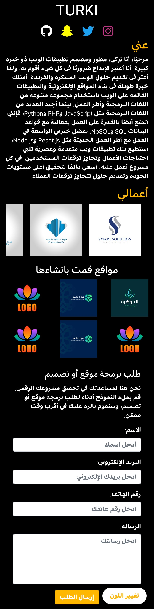

# DVTe

# موقع تعريفي ملوّن

## وصف السكربت

هذا السكربت هو صفحة HTML توضح مثالًا بسيطًا لموقع تعريفي. يعرض المطور معلوماته وأعماله ويتضمن نموذج اتصال بسيط للمستخدمين الذين يرغبون في طلب خدمات تطوير المواقع أو التصميم.

السكربت مصمم لتوفير تصميم جذاب ومتجاوب باستخدام لغات HTML و CSS وإطار العمل Bootstrap. يتضمن السكربت ممارسات تصميم الويب الحديثة ويستخدم رموز الأيقونات Font Awesome لتعزيز تجربة المستخدم وتوفير وصول سريع إلى ملفات التواصل الاجتماعي.

يحتوي السكربت على نموذج اتصال يسمح للمستخدمين بإدخال اسمهم وعنوان البريد الإلكتروني ورقم الهاتف والرسالة. عند النقر فوق زر الإرسال، يتم معالجة بيانات النموذج وإرسالها إلى المطور للتواصل اللاحق.

## المكونات والميزات

يستخدم السكربت عدة مكونات وميزات، بما في ذلك:

- HTML و CSS: يستخدم HTML لترتيب العناصر في الصفحة، بينما يستخدم CSS لتنسيق النصوص وتعريف المظهر البصري.
- Bootstrap: يستخدم إطار العمل Bootstrap لإنشاء تصميم استجابة وجميل للموقع. يضمن أن الموقع يتكيف بشكل جيد مع مختلف أحجام الشاشة والأجهزة.
- رموز الأيقونات Font Awesome: يتم دمج مكتبة رموز الأيقونات Font Awesome لتوفير مجموعة واسعة من الأيقونات الجميلة بما في ذلك رموز الشبكات الاجتماعية الشهيرة.
- نموذج اتصال بسيط: يتضمن السكربت نموذج اتصال بسيط يستقبل اسم المستخدم وعنوان البريد الإلكتروني ورقم الهاتف والرسالة. يسمح هذا للمستخدمين بالتواصل بسهولة مع المطور للاستفسارات أو طلبات المشاريع.

## معاينة الموقع

هنا صورة معاينة للموقع في ثلاثة ألوان مختلفة:

### الألوان

- **اللون الأسود:** يعرض الموقع باللون الأسود تصميمًا أنيقًا ومتطورًا. يضيف اللون الأسود لمسة من الاحترافية ويبرز المحتوى بشكل فعّال.

- **اللون الأبيض:** يعرض الموقع باللون الأبيض مظهرًا نظيفًا وبسيطًا. يعطي اللون الأبيض شعورًا بالنقاء والبساطة، مما يسمح للمحتوى بالتألق.

- **اللون الأزرق الفاتح:** يعرض الموقع باللون الأزرق الفاتح تجربة بصرية منعشة ومريحة. يخلق اللون الأزرق الفاتح جوًا هادئًا ويعزز مشاركة المستخدم بشكل عام.

## كيفية استخدام السكربت

لاستخدام السكربت، اتبع هذه الخطوات:

1. قم بنسخ السكربت المقدم في ملف HTML جديد.
2. قم بتخصيص الصفحة عن طريق تعديل المحتوى داخل عناصر HTML وضبط أنماط CSS لتناسب تفضيلاتك.
3. حدث روابط وسائل التواصل الاجتماعي في رموز الأيقونات Font Awesome لتوجيه المستخدمين إلى ملفات التواصل الاجتماعي الخاصة بك.
4. احفظ الملف بامتداد ".html" وافتحه في متصفح الويب لرؤية التغييرات.
5. يمكنك تعزيز السكربت وتخصيصه بمزيد من الأقسام والعناصر أو دمج وظائف إضافية حسب الحاجة.

يرجى ملاحظة أن هذا المثال هو عرض توضيحي أساسي لصفحة HTML ولا يتضمن ميزات الجانب الخادم (مثل إرسال البريد الإلكتروني). إذا كنت ترغب في دمج وظائف البريد الإلكتروني، فسيكون عليك تنفيذ كود إضافي على الجانب الخادم.

لا تتردد في تكييف وتخصيص السكربت لتلبية متطلبات المشروع الخاصة بك والتوجيهات الخاصة بالعلامة التجارية.

#المعاينة 

يمكنك معاينة السكربت بشكل مباشر عن طريق زيا الرابط التالي :
https://ma9za.github.io/DVTe/
